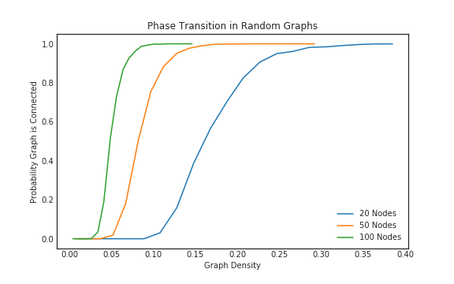
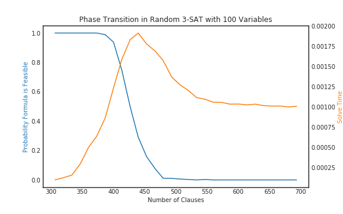

Destined
========

DEclarative Specification for Test INstancE Distributions
~~~~~~~~~~~~~~~~~~~~~~~~~~~~~~~~~~~~~~~~~~~~~~~~~~~~~~~~~

Declare a distribution of instances by specifying function parameters.

.. code:: json

    {
        "generator": "graphs.erdos_renyi",
        "parameters":
        {
            "nodes": {"value": 100},
            "edges": {"value": 2500}
        }
    }

Nest distribution specifications to vary parameters.

.. code:: json

    {
        "generator": "graphs.erdos_renyi",
        "parameters":
        {
            "nodes": {"value": 100},
            "edges":
            {
                "generator": "randint",
                "parameters":
                {
                    "low": {"value": 100},
                    "high": {"value": 4000}
                }
            }
        }
    }

Sample from the distribution using system seeds.

.. code:: sh

    destined evaluate examples/random-graphs.json 1000 -

Examples
~~~~~~~~

Measure connectivity of a particular model of random graphs:

.. code:: json

    {
        "instances": {
            "generator": "graphs.undirected_noloop_erdos_renyi_np",
            "parameters": {
                "nodes": {
                    "generator": "choice",
                    "parameters": {
                        "seq": {"value": [10, 20, 50, 100]}
                    }
                },
                "prob": {
                    "generator": "uniform",
                    "parameters": {
                        "low": {"value": 0},
                        "high": {"value": 0.6}
                    }
                }
            }
        },
        "attributes": "graphs.features"
    }

Evaluating this data shows probability of connectedness of these graphs given their density:

Measure satisfiability of the uniform random 3-sat model:

.. code:: json

    {
        "instances": {
            "generator": "sat.uniform_k_sat",
            "parameters": {
                "nvariables": {"value": 100},
                "nclauses": {
                    "generator": "randint",
                    "parameters": {
                        "low": {"value": 10},
                        "high": {"value": 1000}
                    }
                },
                "clause_length": {"value": 3}
            }
        },
        "attributes": "sat.features"
    }

Evaluating this data shows probability of feasibility of these formulae given the clause/variable ratio:

* Free software: MIT license
