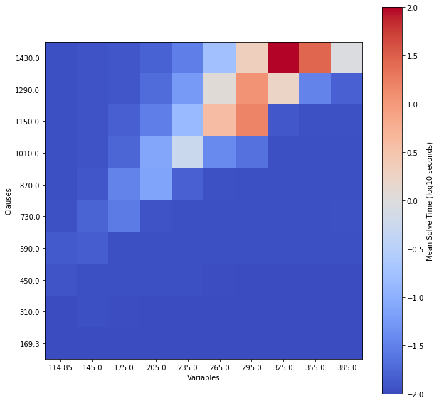

### General idea behind the [destined](https://github.com/simonbowly/destined) tool (oh yes, backronym) ...

So let's say you're evaluating SAT solver performance ...

Define a generator algorithm `uniform_k_sat` which produces random SAT instances (fixed clause length, uniform variable selection and negation).
This code is all kept in a standard library of generators; no one should need to think about it when running an experiment.

```python
def uniform_k_sat(nvariables, nclauses, clause_length):
    ...
```

The user gives the specification for instances (controlling size, structure, etc).
(Also includes which solvers to run/which instance features to calculate, although this should maybe be given outside this file?)

```json
{
    "instances": {
        "generator": "sat.uniform_k_sat",
        "parameters": {
            "nvariables": {
                "generator": "randint",
                "parameters": {
                    "low": {"value": 100},
                    "high": {"value": 400}
                }
            },
            "nclauses": {
                "generator": "randint",
                "parameters": {
                    "low": {"value": 100},
                    "high": {"value": 1500}
                }
            },
            "clause_length": {"value": 3}
        }
    },
    "algorithms": ["clasp"]
}
```

Command line tool goes and evaluates it for a given number of samples.

```
>> destined evaluate specification-file num-samples results-file
```

Show solver performance aggregated over the distribution parameters.

<!--  -->


I'm thinking about all of this in terms of evaluating solver performance vs instance features to discover particular weaknesses.
But I also like the idea of defining a benchmark set this way (instead of as a collection of flat files somewhere) so that it's an agreed upon standard for comparing algorithms which prevents overtuning to specific instances.

Not sure if useful ... thoughts? ;)
